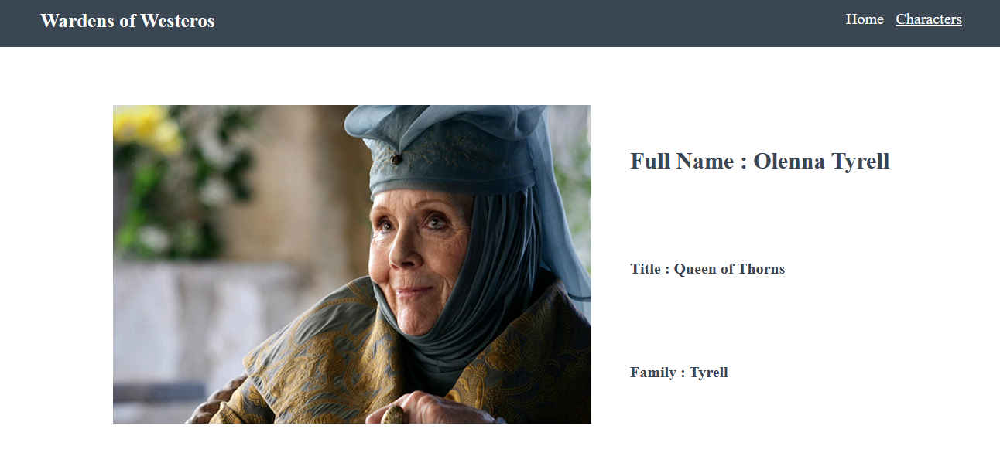

# Wardens of Westeros
Available at: https://wardensofwesteros.netlify.app/#/

## Project Overview:
Wardens of Westeros is a tool for identifying over 50 of the most common Game of Thrones characters.

## Key Features:
Wardens of Westeros can:
Find a character by image
Find the full name, title, and family of the selected character.

### API Used:
https://thronesapi.com/

### Preview:

